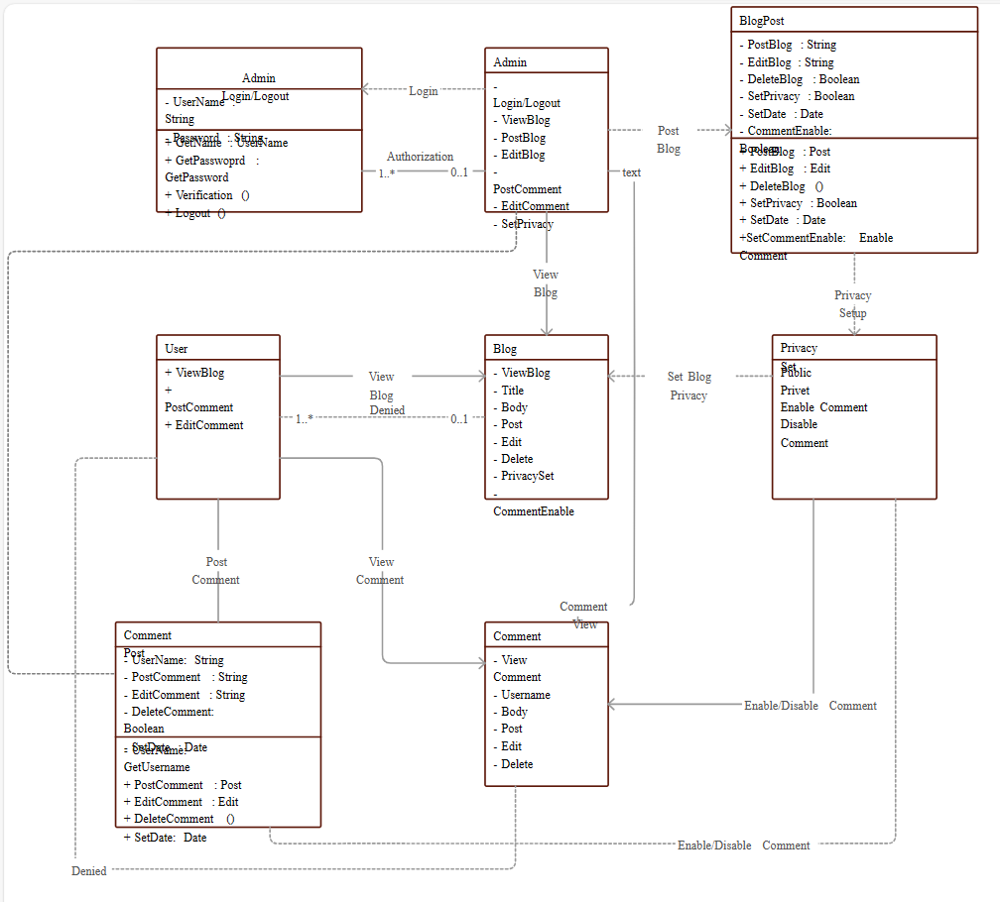

# Binary and Blogs

Binary and Blogs is a blog platform built using NestJS, TypeORM, and MySQL. This platform aims to provide a space for developers and tech enthusiasts to share insights, stories, and updates in the world of programming and technology.

## Project Structure

The project follows a typical NestJS application structure:

 
- **controllers/**: Contains the controllers for handling HTTP requests.
- **dto/**: Data Transfer Objects for handling data validation and transformation.
- **entities/**: Database entities defined using TypeORM decorators.
- **middlewares/**: Custom middlewares used in the application.
- **modules/**: NestJS modules to organize the application.
- **services/**: Contains business logic and services.
- **main.ts**: The entry point of the application.

## Tech Stack

- **NestJS**: A progressive Node.js framework for building efficient, scalable server-side applications.
- **TypeORM**: An Object-Relational Mapper (ORM) for TypeScript and JavaScript (ES7, ES6, ES5). It supports various databases, including MySQL.
- **MySQL**: A popular open-source relational database management system.

## Class Diagram

Below is a simple representation of the class structure for the application:

## Getting Started

1. Clone the repository.
2. Install the dependencies using `npm install`.
3. Set up your MySQL database and update the configuration in the `.env` file.
4. Run the application using `npm start`.

Feel free to contribute and improve this project by submitting issues or pull requests.
